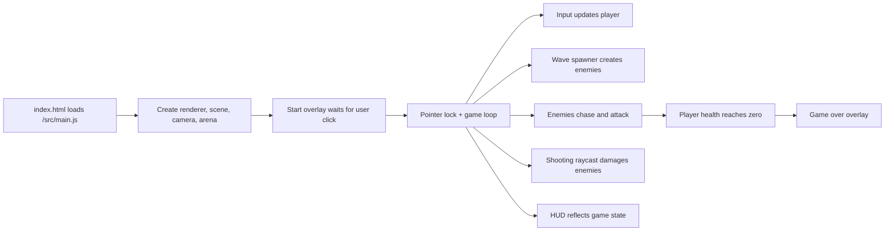

# Architecture

> 记录项目结构、模块边界和核心数据流。项目变大后，agent 先看这里再动结构。

## 架构概览

Demo_01 当前是一个 Vite + Three.js 浏览器 3D 游戏原型。`index.html` 提供 Canvas 和 HUD 容器，`src/main.js` 负责创建 Three.js 场景、游戏循环、输入、玩家、敌人、补给和 HUD 更新，`src/styles.css` 负责全屏游戏 UI。

运行时是纯前端：没有后端、数据库、账号、遥测或网络游戏逻辑。所有第一版视觉资产均由 Three.js 几何体、材质、灯光和雾效程序化生成。

## 顶层目录职责

```text
.
├── index.html                         # 游戏 HTML 入口和 HUD 容器
├── package.json                       # npm 脚本和依赖声明
├── package-lock.json                  # 锁定依赖版本
├── src/                               # 游戏源码、样式和 Three.js 逻辑
├── AGENTS.md                          # 项目最高宪法源
├── CLAUDE.md                          # Claude Code 入口，只转发到 AGENTS.md
├── CHANGELOG.md                       # 用户可见变化记录
├── .vibe-starter-gpt.json             # 宪法安装元信息
├── .editorconfig                      # 基础格式约定
├── .gitignore                         # 忽略规则
├── lefthook.yml                       # 可选本地质量门禁模板
├── .github/                           # PR 模板与 CI 模板
├── docs/                              # 架构、状态、接口、技术债、ADR
└── specs/                             # 功能规格工作流
```

## 核心流程



## 模块边界

| 模块 / 目录 | 职责 | 可以依赖 | 禁止依赖 |
|---|---|---|---|
| `src/main.js` | Three.js 初始化、游戏循环、输入、玩家/敌人/补给状态 | `three`、浏览器 Web API、`src/styles.css` | 不写入文档事实、不引入网络服务、不使用版权素材 |
| `src/styles.css` | 全屏 Canvas、HUD、开始/重开覆盖层样式 | DOM 结构中的稳定 ID/class | 不承载游戏逻辑 |
| `index.html` | HTML 入口、HUD DOM 契约、模块脚本引用 | `/src/main.js` | 不堆业务逻辑 |
| `docs/` | 长期项目事实、架构、接口、债务、决策记录 | AGENTS.md 中的规则 | 不能记录未确认事实 |
| `specs/` | 新功能规格和验收标准 | docs/decisions/、docs/interfaces.md | 不能替代实际验证 |

## 架构约束

- 新增运行时依赖必须写 ADR 或更新现有 ADR。
- 新功能开工前优先写 `specs/active/<slug>.md`。
- 任何 RE4/Capcom 具体内容都不允许进入源码或素材。
- 第一版不加入联网、账号、云存档、遥测、广告或排行榜。

## 变更规则

任何影响以下内容的改动必须写 ADR：

- 技术栈或引擎选择
- 顶层目录职责
- 模块依赖方向
- 核心数据结构
- 外部接口或协议
- 持久化格式
- 运行、构建、发布方式
